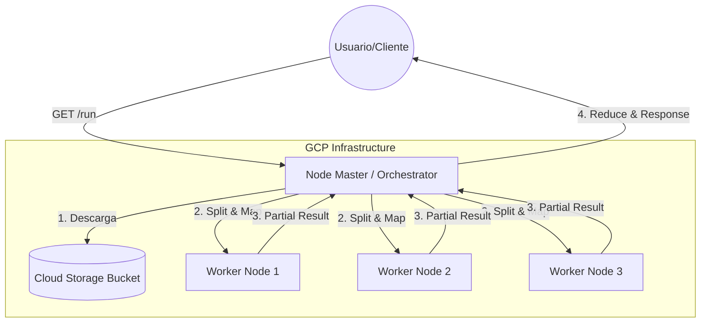

# Explicación Visual: El Proceso MapReduce

En este laboratorio, hemos construido un sistema que procesa datos de forma distribuida. Aquí te explicamos cómo interactúan los **Nodos** y los **Workers**.

## 1. Arquitectura de Nodos

El sistema se compone de dos tipos de roles principales ejecutándose en máquinas virtuales (VMs) de Google Compute Engine:

### El Maestro (Master Node)
Es el "cerebro" de la operación. Sus tareas son:
- **Descargar**: Trae el archivo `archivo.txt` desde el bucket de GCS.
- **Fragmentar (Split)**: Divide el texto en partes iguales según el número de trabajadores activos.
- **Orquestar**: Envía cada fragmento a un trabajador diferente vía HTTP POST.
- **Reducir (Reduce)**: Recibe los conteos parciales y los suma todos para obtener el resultado final.

### Los Trabajadores (Worker Nodes)
Son los "brazos" ejecutores. Ejecutan el código de `worker.py`:
- **Recibir**: Escuchan en el puerto 5000 esperando un fragmento de texto.
- **Mapear (Map)**: Limpian el texto (quitan mayúsculas, signos) y cuentan cuántas veces aparece cada palabra.
- **Responder**: Devuelven un diccionario JSON con sus resultados locales (ej. `{"hola": 2, "gcp": 1}`).

---

## 2. El Flujo de Datos (Step-by-Step)

Imagina que procesamos la frase: *"hola mundo gcp hola"* con 2 Workers.

### Fase 1: Split (División)
El Master divide la tarea:
- **Chunk 1**: "hola mundo" -> va para el **Worker 1**.
- **Chunk 2**: "gcp hola" -> va para el **Worker 2**.

### Fase 2: Map (Conteo Local)
Cada Worker trabaja en paralelo:
- **Worker 1** responde: `{"hola": 1, "mundo": 1}`
- **Worker 2** responde: `{"gcp": 1, "hola": 1}`

### Fase 3: Reduce (Agregación)
El Master recibe ambos diccionarios y los suma:
- "hola": 1 (del W1) + 1 (del W2) = **2**
- "mundo": 1 (del W1) = **1**
- "gcp": 1 (del W2) = **1**

**Resultado Final**: `{"hola": 2, "mundo": 1, "gcp": 1}`

---

## 3. ¿Por qué es escalable?
Si en lugar de un archivo pequeño tuviéramos un libro de 1GB, no podríamos procesarlo en una sola máquina rápidamente. 
Con esta arquitectura, simplemente activamos **10, 50 o 100 Workers**, y el Master repartirá la carga entre todos ellos, procesando el libro en segundos en lugar de minutos.
